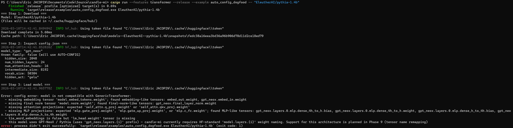

# Examples


Runnable examples demonstrating candle-mi features.

## Available Examples

| Example | Features | Description |
|---------|----------|-------------|
| `quick_start_transformer` | `transformer` | Discover cached transformers, run inference, print top-5 predictions |
| `fast_download` | *(default)* | Download a model from `HuggingFace` Hub with parallel chunked transfers |
| `quick_start_sae` | `sae`, `transformer` | Load an SAE, encode model activations, print top features and reconstruction error |
| `auto_config_dogfood` | `transformer` | Download a model and test auto-config loading with compatibility check |
| `generate` | `transformer` | Greedy autoregressive text generation on all cached models |
| `logit_lens` | `transformer` | Layer-by-layer prediction tracking via residual stream projection |
| `attention_knockout` | `transformer` | Knock out a specific attention edge (last→first token), measure KL divergence and top changed tokens |
| `steering_dose_response` | `transformer` | Sweep steering dose levels, build a dose-response curve, and interpolate target attention |
| `attention_patterns` | `transformer` | Capture and analyze per-head attention patterns at every layer |
| `activation_patching` | `transformer` | Causal tracing via position-specific activation patching (Meng et al., 2022) |
| `token_positions` | *(default)* | Character-to-token mapping with `EncodingWithOffsets` and `convert_positions` |
| `rwkv_inference` | `rwkv` | RWKV-7 linear RNN inference with state hook capture and state knockout |
| `recurrent_feedback` | `transformer` | Anacrousis / recurrent passes for rhyme completion (Taufeeque et al., 2024) |
| `character_count_helix` | `transformer` | Replicate the character count helix from [Gurnee et al. (2025)](https://transformer-circuits.pub/2025/linebreaks/index.html) via PCA on residual stream activations |
| `figure13_planning_poems` | `clt`, `transformer` | Replication of [Anthropic's Figure 13](https://transformer-circuits.pub/2025/attribution-graphs/biology.html#dives-poem-location) (suppress + inject position sweep) |

## Running

```bash
# Transformer inference on all cached models
cargo run --release --example quick_start_transformer

# Download a model (defaults to a tiny test repo)
cargo run --example fast_download -- meta-llama/Llama-3.2-1B

# SAE encoding on Gemma 2 2B
cargo run --release --features sae,transformer --example quick_start_sae

# Auto-config dogfooding — success (known model family, manual parser)
cargo run --release --features transformer --example auto_config_dogfood -- "meta-llama/Llama-3.2-1B"

# Auto-config dogfooding — failure (unsupported architecture)
cargo run --release --features transformer --example auto_config_dogfood -- "allenai/OLMo-1B-hf"

# Auto-config dogfooding — failure with actionable hints (non-standard naming)
cargo run --release --features transformer --example auto_config_dogfood -- "EleutherAI/pythia-1.4b"

# Greedy text generation — single model (recommended for 7B+ to avoid OOM)
cargo run --release --features transformer --example generate -- "meta-llama/Llama-3.2-1B"

# Greedy text generation — all cached models (add mmap for sharded weights)
cargo run --release --features transformer,mmap --example generate

# Logit lens — single model
cargo run --release --features transformer --example logit_lens -- "meta-llama/Llama-3.2-1B"

# Logit lens — with JSON output
cargo run --release --features transformer --example logit_lens -- "meta-llama/Llama-3.2-1B" --output examples/results/logit_lens/llama-3.2-1b.json

# Logit lens — all cached models
cargo run --release --features transformer,mmap --example logit_lens

# Attention knockout — single model
cargo run --release --features transformer --example attention_knockout -- "meta-llama/Llama-3.2-1B"

# Attention knockout — all cached models
cargo run --release --features transformer,mmap --example attention_knockout

# Steering dose-response — single model
cargo run --release --features transformer --example steering_dose_response -- "meta-llama/Llama-3.2-1B"

# Steering dose-response — all cached models
cargo run --release --features transformer,mmap --example steering_dose_response

# Attention patterns — single model
cargo run --release --features transformer --example attention_patterns -- "meta-llama/Llama-3.2-1B"

# Attention patterns — all cached models
cargo run --release --features transformer,mmap --example attention_patterns

# Activation patching (causal tracing) — single model
cargo run --release --features transformer --example activation_patching -- "meta-llama/Llama-3.2-1B"

# Activation patching — all cached models
cargo run --release --features transformer,mmap --example activation_patching

# Token positions — single model (tokenizer only, no GPU)
cargo run --example token_positions -- "meta-llama/Llama-3.2-1B"

# Token positions — all cached models
cargo run --example token_positions

# RWKV inference — auto-discover cached RWKV models
cargo run --release --features rwkv --example rwkv_inference

# RWKV inference — specific model
cargo run --release --features rwkv --example rwkv_inference -- "RWKV/RWKV7-Goose-World3-1.5B-HF"

# RWKV inference — RWKV-6 model (requires rwkv-tokenizer feature)
cargo run --release --features rwkv,rwkv-tokenizer --example rwkv_inference -- "RWKV/v6-Finch-1B6-HF"

# Recurrent feedback — default (Llama 3.2 1B, unembed layers 8-15, strength 2.0)
cargo run --release --features transformer --example recurrent_feedback

# Recurrent feedback — with JSON output (prefill mode)
cargo run --release --features transformer --example recurrent_feedback -- --output examples/results/recurrent_feedback/prefill.json

# Recurrent feedback — sustained mode with JSON output
cargo run --release --features transformer --example recurrent_feedback -- --sustained --loop-start 14 --loop-end 15 --strength 1.0 --output examples/results/recurrent_feedback/sustained.json

# Recurrent feedback — custom layer range and couplet limit
cargo run --release --features transformer --example recurrent_feedback -- --loop-start 14 --loop-end 15 --max-couplets 5

# Character count helix — default model (Gemma 2 2B, requires mmap for sharded weights)
cargo run --release --features transformer,mmap --example character_count_helix

# Character count helix — with JSON output for Mathematica plotting
cargo run --release --features transformer,mmap --example character_count_helix -- --output examples/results/character_count_helix/helix_output.json

# Character count helix — compare variance across layers 0-3
cargo run --release --features transformer,mmap --example character_count_helix -- --all-layers

# Character count helix — use a bundled prose file (Gettysburg Address)
cargo run --release --features transformer,mmap --example character_count_helix -- --text examples/results/character_count_helix/texts/gettysburg.txt

# Character count helix — use a bundled prose file (Dickens)
cargo run --release --features transformer,mmap --example character_count_helix -- --text examples/results/character_count_helix/texts/dickens_two_cities.txt

# Character count helix — non-sharded model (mmap not needed)
cargo run --release --features transformer --example character_count_helix -- "meta-llama/Llama-3.2-1B"

# Figure 13 replication — Llama 3.2 1B (default)
cargo run --release --features clt,transformer --example figure13_planning_poems

# Figure 13 replication — Gemma 2 2B, 426K CLT (requires mmap for sharded weights)
cargo run --release --features clt,transformer,mmap --example figure13_planning_poems -- --preset gemma2-2b-426k

# Figure 13 replication — Gemma 2 2B, 2.5M CLT (word-level features)
cargo run --release --features clt,transformer,mmap --example figure13_planning_poems -- --preset gemma2-2b-2.5m
```

### Example output: `logit_lens`

Prompt: *"The capital of France is"* — tracking when "Paris" first enters the
top predictions across layers.

**Llama 3.2 1B** (16 layers): "Paris" first appears at layer 11 (rank 1).
Early layers predict generic tokens ("is", "was"); by layer 4 semantic concepts
emerge ("city", "capitals"). At layer 11, "Paris" surfaces alongside related
cities (Marseille, Bordeaux, Brussels). Convergence at ~69% depth — typical for
factual recall in small LLMs.

**Gemma 2 2B** (26 layers): "Paris" first appears at layer 25 (rank 8, the very
last layer). Through most of its depth, Gemma 2 strongly predicts continuation
patterns — " is" dominates layers 0-14 (often 99.9%), then " also" takes over
(layers 15-21), then " a" (layers 22-25). Factual resolution happens extremely
late; "Paris" only barely enters the top-10 at 0.001% probability.

**StarCoder2 3B** (30 layers): "Paris" as a complete token never reaches top-10.
However, the BPE subword " Par" (the first piece of " Paris") dominates from
layer 22 onward (33% → 74% by layer 26), alongside variants "Par", " par",
"PAR". The model clearly knows the answer but its code-oriented tokenizer splits
" Paris" across multiple tokens, so the `first_appearance` substring check
misses it.

### Example output: `attention_knockout`

Prompt: *"The capital of France is"* — knock out the attention edge from the
last token to position 0 (first token) across all heads at the middle layer.

| Model | Layer | Heads | KL div | "Paris" baseline | "Paris" ablated | Logit diff |
|-------|-------|-------|--------|-----------------|----------------|------------|
| Llama 3.2 1B | 8 | 32 | 0.056 | 39.3% | 26.0% | +0.55 |
| Gemma 2 2B | 13 | 8 | 0.017 | 3.9% | 6.7% | −0.33 |
| StarCoder2 3B | 15 | 24 | 0.029 | 40.9% (" Par") | 32.2% (" Par") | −1.08 |

**Llama 3.2 1B** shows the strongest effect: "Paris" drops from 39.3% to
26.0% when the last token can't attend to the first token at layer 8.
The model relies on early-position attention at mid-depth for factual recall.

**Gemma 2 2B** shows an inverted effect: "Paris" *increases* from 3.9% to
6.7%. The middle-layer attention edge carries inhibitory signal — hedging
tokens ("also", "not") drop when it's removed, consistent with Gemma 2's
late factual resolution (layers 22+).

**StarCoder2 3B** shows " Par" (BPE subword for "Paris") dropping from 40.9%
to 32.2%. Code tokens ("{", "{}") rise and competing capitals ("Mad",
"London") appear — the model partially reverts to its code-completion prior.

### Example output: `steering_dose_response`

Prompt: *"The capital of France is"* — steer the attention edge from the last
token to position 0 at the middle layer, sweeping 6 dose levels.

| Model | Layer | Baseline attn | Dose 0.5 KL | Dose 4.0 KL | Dose 6.0 KL |
|-------|-------|--------------|-------------|-------------|-------------|
| Llama 3.2 1B | 8 | 0.630 | 0.006 | 0.029 | 0.043 |
| Gemma 2 2B | 13 | 0.589 | 0.001 | 0.002 | 0.003 |
| StarCoder2 3B | 15 | 0.673 | 0.002 | 0.004 | 0.005 |

**Llama 3.2 1B** shows the strongest dose-response: KL divergence grows from
0.006 at half-dose to 0.043 at 6× dose, with "Paris" logit diff reaching
−0.31. The model's factual recall is sensitive to attention steering at
mid-depth.

**Gemma 2 2B** shows much weaker sensitivity: KL stays below 0.004 even at 6×
dose. With GQA (8 KV heads) and soft-capped logits, the prediction
distribution is robust to single-edge steering.

### Example output: `attention_patterns`

Prompt: *"The capital of France is"* — capture attention at every layer and
analyze what the last token attends to.

| Model | Peak layer (last→first) | Peak attention | Top-1 at most layers |
|-------|------------------------|----------------|---------------------|
| Llama 3.2 1B | 2 | 0.847 | `<\|begin_of_text\|>` (BOS) |
| Gemma 2 2B | 22 | 0.845 | `<bos>` (BOS) |
| StarCoder2 3B | 26 | 0.866 | `The` (first real token, no BOS) |

All three models show strong attention to the first token across most layers
(the "BOS sink" pattern). **StarCoder2 3B** lacks a BOS token so the first
real token ("The") serves as the attention sink. **Llama 3.2 1B** peaks early
(layer 2), while **Gemma 2 2B** peaks late (layer 22).

### Example output: `activation_patching`

Clean prompt: *"The capital of France is"* vs. corrupted: *"The capital of Poland
is"*. For each layer, the clean residual at the subject position ("France") is
patched into the corrupted forward pass. Recovery measures how much the clean
"Paris" prediction is restored.

| Model | Subject pos | Corrupted KL | Best layer | Best recovery | Sharp cliff |
|-------|------------|-------------|------------|--------------|-------------|
| Llama 3.2 1B | 4 | 3.78 | 1 (100%) | Layers 0-8: >99% | Layer 9-15: 92%→0% |
| Gemma 2 2B | 4 | 0.50 | 1 (100%) | Layers 0-17: >89% | Layer 18-25: 74%→0% |
| StarCoder2 3B | 3 | 4.16 | 9 (99.9%) | Layers 0-20: >94% | Layer 21: 5% cliff |

**Llama 3.2 1B** shows a gradual decline: recovery drops from 100% at early
layers to 72% at layer 11, reaching 0% by the final layer. The factual
association "France → Paris" forms in the middle layers (8-13).

**Gemma 2 2B** maintains high recovery through layer 17 (89%), then drops
sharply. The factual lookup happens later in the network, consistent with
its deeper architecture.

**StarCoder2 3B** shows an abrupt cliff at layer 21: recovery drops from
94% to 5% in a single layer. As a code model, it stores factual knowledge
in a concentrated layer band.

### Example output: `token_positions`

Text: *"The Eiffel Tower is located in Paris, France."* — mapping character
annotations to token positions across different tokenizers.

| Entity | Char range | Llama 3.2 1B tokens | Gemma 2 2B tokens | StarCoder2 3B tokens |
|--------|-----------|--------------------|--------------------|---------------------|
| "Eiffel Tower" | 4-16 | 4 tokens (E+iff+el+Tower) | 2 tokens (Eiffel+Tower) | 5 tokens (E+iff+el+T+ower) |
| "Paris" | 31-36 | 1 token | 1 token | 2 tokens (Par+is) |
| "France" | 38-44 | 1 token | 1 token | 1 token |

The example shows how the same character span maps to different numbers of
tokens across models. `char_range_to_tokens()` handles this automatically,
and `convert_positions()` provides exact-vs-fuzzy matching for positions
between or beyond token boundaries.

### Example output: `rwkv_inference`

Prompt: *"The capital of France is"* — RWKV-7 linear RNN inference with state
hooks and state knockout.

**RWKV-7 Goose 1.5B**: Top-1 prediction is "Paris" at high probability. The
example captures RWKV-specific hook points — `RwkvState` (recurrent state
matrix, shape `[1, heads, head_dim, head_dim]`), `RwkvDecay` (data-dependent
decay), and `ResidPost` (residual stream) — demonstrating the structural
differences between recurrent and attention-based architectures.

State knockout at position 0 (making the first token invisible to future tokens)
shows the impact on factual recall via KL divergence and top changed tokens.

### Example output: `recurrent_feedback`

15 canonical couplets from Taufeeque et al. (2024) — baseline generation vs.
recurrent feedback with averaged rhyme direction injection.

| Mode | Settings | Rhymes | Rescued |
|------|----------|--------|---------|
| Baseline | — | 9/15 | — |
| Recurrent (prefill) | unembed L8–15, s=2.0 | 11/15 | +2 |
| Recurrent (sustained) | unembed L14–15, s=1.0 | 9/15 | +0 |

Per-couplet breakdown (from golden JSON in `results/recurrent_feedback/`):

| id | target | baseline | prefill L8–15 s=2.0 | sustained L14–15 s=1.0 |
|----|--------|----------|---------------------|------------------------|
| 1 | light | light | light | light |
| 2 | play | talk X | laugh X | talk X |
| 3 | sound | flashes X | flashes X | flashes X |
| 4 | rain | falls X | ground X | ground X |
| 5 | time | time | time | time |
| 6 | air | air | air | air |
| 7 | gold | fair X | fair X | fair X |
| 8 | fire | embers X | **fire RESCUED** | embers X |
| 9 | stone | stone | stone | stone |
| 10 | dream | dream | dream | dream |
| 11 | strange | alone X | **strange RESCUED** | alone X |
| 12 | love | love | love | love |
| 13 | truth | truth | truth | truth |
| 14 | world | world | world | world |
| 15 | earth | earth | earth | earth |

**Prefill mode** (default) re-runs the recurrent block (double pass + feedback
injection) over the original prompt tokens before generation starts.
**Sustained mode** (`--sustained`) additionally re-runs the recurrent block at
the current last token during each autoregressive generation step. Prefill mode
with layers 8–15 and strength 2.0 shows the best improvement (+2 rescued
couplets: fire and strange, both producing the exact target word).

**Why candle-mi differs from plip-rs.** candle-mi recomputes the full sequence
at each generation step (no KV cache), so "prefill-only" mode already
re-applies the recurrent block over the entire prompt at every step — making it
functionally closer to plip-rs's sustained mode. In plip-rs (which uses KV
cache), prefill-only truly fires once and sustained mode was needed to get +1.
In candle-mi, prefill-only already achieves +2 because every generation step
benefits from the double pass. This is an MI-first design trade-off:
full-sequence recompute is slower but gives maximum observability — hooks can
re-observe how earlier positions change under intervention at every step, and
interventions "just work" without KV cache invalidation.

Resistant failures (2, 3, 4, 7) persist across both conditions, representing
couplets where no quality-preserving intervention redirects the generation
trajectory.

Output JSON and Mathematica plotting script are in
[`examples/figure13/`](figure13/) and [`examples/results/recurrent_feedback/`](results/recurrent_feedback/).

**References:**
- Taufeeque et al., "Planning in a recurrent neural network that plays Sokoban", [arXiv:2407.15421](https://arxiv.org/abs/2407.15421v2), 2024
- Taufeeque et al., "Path Channels and Plan Extension Kernels: a Mechanistic Description of Planning in a Sokoban RNN", [arXiv:2506.10138](https://arxiv.org/abs/2506.10138), 2025 — reverse-engineers the planning circuits discovered in the 2024 paper
- Lindsey et al., ["On the Biology of a Large Language Model"](https://transformer-circuits.pub/2025/attribution-graphs/biology.html), 2025
- Eric Jacopin, ["Replicating 'Planning in Poems' with Open Tools"](https://github.com/PCfVW/plip-rs/tree/melometis/docs/planning-in-poems) (plip-rs melometis branch)

### Example output: `character_count_helix`

Replicates the core finding from [Gurnee et al. (2025)](https://transformer-circuits.pub/2025/linebreaks/index.html)
"When Models Manipulate Manifolds" (Transformer Circuits). The model's residual stream represents line
character count (characters since the last `\n`) as a helical 1D manifold in a
low-dimensional subspace.

The example wraps prose at 14 different line widths (20-150 chars), runs forward
passes capturing `ResidPost` at an early layer, averages residual vectors by
character count, and performs PCA on the resulting mean vectors. Expected results:

- **Helix geometry**: The top 6 PCs capture ~95% of variance. Projecting the
  150 mean vectors into PC1-3 reveals a helical curve.
- **Ringing pattern**: The cosine similarity matrix shows off-diagonal
  oscillation — nearby character counts are positively correlated, those further
  apart are negatively correlated, then positive again (Gibbs-phenomenon-like
  ringing from projecting a high-curvature curve into low dimensions).

The `--text` flag lets you supply your own prose file to test whether the helix
generalises across different text content. The `--all-layers` flag compares
variance capture across layers 0-3.

Output JSON and Mathematica plotting script (3D helix, cosine heatmap, variance
bars) are in [`examples/results/character_count_helix/`](results/character_count_helix/).

**Reference:** Gurnee et al., ["When Models Manipulate Manifolds"](https://transformer-circuits.pub/2025/linebreaks/index.html), Transformer Circuits, October 2025.

### Example output: `auto_config_dogfood`

**Success** on Llama 3.2 1B (known family, uses manual parser):


**Failure** on OLMo-1B (unsupported architecture):


OLMo-1B fails the compatibility check because its weight names
(`model.layers.*.input_layernorm.weight`, `model.final_norm.weight`) do not
match the normalisation tensor patterns that `GenericTransformer` expects.
candle-mi currently supports 7 model families: LLaMA, Qwen2, Gemma, Gemma 2,
Phi-3, Mistral, and StarCoder2.

**Failure with actionable diagnostics** on Pythia 1.4B (non-standard naming):



Pythia uses the `gpt_neox.layers.{i}` weight prefix instead of the
HF-standard `model.layers.{i}`. The error message now shows which tensors
*were* found for each expected category (embedding, norm, attention, MLP),
detects the GPT-NeoX / Pythia naming convention, and points to Phase 9
(tensor name remapping) for planned support.

### Example output: `figure13_planning_poems`

Replicates [Anthropic's Figure 13](https://transformer-circuits.pub/2025/attribution-graphs/biology.html#dives-poem-location)
from "On the Biology of a Large Language Model": suppress natural rhyme
features and inject an alternative, sweeping injection position across all
tokens.  Three presets are available: `llama3.2-1b-524k` (Llama 3.2 1B),
`gemma2-2b-426k` (Gemma 2 2B, 426K CLT), and `gemma2-2b-2.5m` (Gemma 2 2B,
2.5M CLT with word-level feature granularity).

Output JSON and Mathematica plotting script are in
[`examples/figure13/`](figure13/).

## Prerequisites

- **quick_start_transformer** and **quick_start_sae** require models cached
  in `~/.cache/huggingface/hub/`. Download them first with `fast_download`
  or via Python (`huggingface_hub.snapshot_download()`).
- **quick_start_sae** downloads the Gemma Scope SAE (`google/gemma-scope-2b-pt-res`)
  automatically via `hf-fetch-model`.
- **figure13_planning_poems** requires a CLT from `HuggingFace` (downloaded
  automatically on first run). Gemma 2 2B preset requires `--features mmap`.
- **rwkv_inference** requires an RWKV model cached locally. RWKV-7 models
  include `tokenizer.json`; RWKV-6 models require `--features rwkv-tokenizer`.
- **recurrent_feedback** requires `meta-llama/Llama-3.2-1B` (default) cached
  locally.
- **character_count_helix** defaults to `google/gemma-2-2b` (~8 GB VRAM at F32,
  requires `--features mmap` for sharded weights). Two bundled prose files
  (Gettysburg Address, Dickens) are in `results/character_count_helix/texts/`.
  Use `--text` to supply any plain-text file.
- **GPU recommended** for models larger than 1B parameters. candle-mi is
  developed on an RTX 5060 Ti (16 GB VRAM) with 64 GB RAM and CUDA 13.1.
