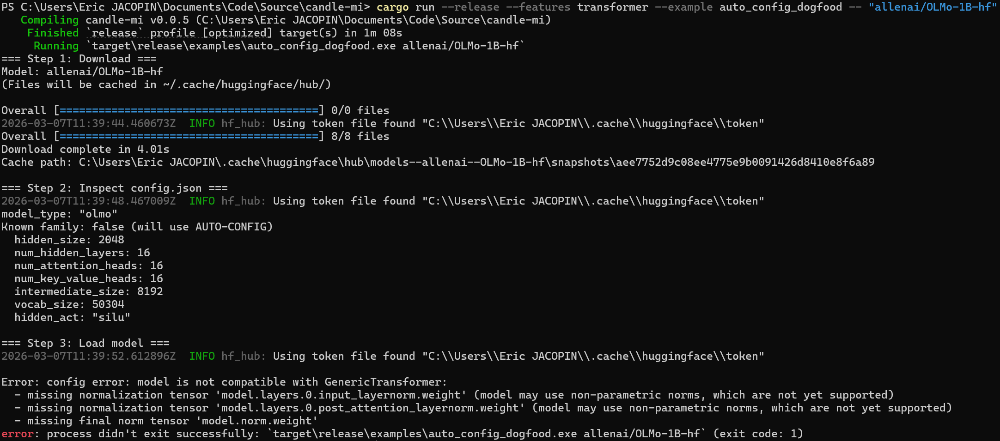

# Examples


Runnable examples demonstrating candle-mi features.

## Available Examples

| Example | Features | Description |
|---------|----------|-------------|
| `quick_start_transformer` | `transformer` | Discover cached transformers, run inference, print top-5 predictions |
| `fast_download` | *(default)* | Download a model from `HuggingFace` Hub with parallel chunked transfers |
| `quick_start_sae` | `sae`, `transformer` | Load an SAE, encode model activations, print top features and reconstruction error |
| `auto_config_dogfood` | `transformer` | Download a model and test auto-config loading with compatibility check |
| `generate` | `transformer` | Greedy autoregressive text generation on all cached models |
| `logit_lens` | `transformer` | Layer-by-layer prediction tracking via residual stream projection |
| `attention_knockout` | `transformer` | Knock out a specific attention edge (last→first token), measure KL divergence and top changed tokens |
| `figure13_planning_poems` | `clt`, `transformer` | Replication of [Anthropic's Figure 13](https://transformer-circuits.pub/2025/attribution-graphs/biology.html#dives-poem-location) (suppress + inject position sweep) |

## Running

```bash
# Transformer inference on all cached models
cargo run --release --example quick_start_transformer

# Download a model (defaults to a tiny test repo)
cargo run --example fast_download -- meta-llama/Llama-3.2-1B

# SAE encoding on Gemma 2 2B
cargo run --release --features sae,transformer --example quick_start_sae

# Auto-config dogfooding — success (known model family, manual parser)
cargo run --release --features transformer --example auto_config_dogfood -- "meta-llama/Llama-3.2-1B"

# Auto-config dogfooding — failure (unsupported architecture)
cargo run --release --features transformer --example auto_config_dogfood -- "allenai/OLMo-1B-hf"

# Greedy text generation — single model (recommended for 7B+ to avoid OOM)
cargo run --release --features transformer --example generate -- "meta-llama/Llama-3.2-1B"

# Greedy text generation — all cached models (add mmap for sharded weights)
cargo run --release --features transformer,mmap --example generate

# Logit lens — single model
cargo run --release --features transformer --example logit_lens -- "meta-llama/Llama-3.2-1B"

# Logit lens — all cached models
cargo run --release --features transformer,mmap --example logit_lens

# Attention knockout — single model
cargo run --release --features transformer --example attention_knockout -- "meta-llama/Llama-3.2-1B"

# Attention knockout — all cached models
cargo run --release --features transformer,mmap --example attention_knockout

# Figure 13 replication — Llama 3.2 1B (default)
cargo run --release --features clt,transformer --example figure13_planning_poems

# Figure 13 replication — Gemma 2 2B, 426K CLT (requires mmap for sharded weights)
cargo run --release --features clt,transformer,mmap --example figure13_planning_poems -- --preset gemma2-2b-426k

# Figure 13 replication — Gemma 2 2B, 2.5M CLT (word-level features)
cargo run --release --features clt,transformer,mmap --example figure13_planning_poems -- --preset gemma2-2b-2.5m
```

### Example output: `auto_config_dogfood`

**Success** on Llama 3.2 1B (known family, uses manual parser):


**Failure** on OLMo-1B (unsupported architecture):



OLMo-1B fails the compatibility check because its weight names
(`model.layers.*.input_layernorm.weight`, `model.final_norm.weight`) do not
match the normalisation tensor patterns that `GenericTransformer` expects.
candle-mi currently supports 6 model families: LLaMA, Qwen2, Gemma/Gemma 2,
Phi-3, Mistral, and StarCoder2.

### Example output: `figure13_planning_poems`

Replicates [Anthropic's Figure 13](https://transformer-circuits.pub/2025/attribution-graphs/biology.html#dives-poem-location)
from "On the Biology of a Large Language Model": suppress natural rhyme
features and inject an alternative, sweeping injection position across all
tokens.  Three presets are available: `llama3.2-1b-524k` (Llama 3.2 1B),
`gemma2-2b-426k` (Gemma 2 2B, 426K CLT), and `gemma2-2b-2.5m` (Gemma 2 2B,
2.5M CLT with word-level feature granularity).

Output JSON and Mathematica plotting script are in
[`examples/figure13/`](figure13/).

## Prerequisites

- **quick_start_transformer** and **quick_start_sae** require models cached
  in `~/.cache/huggingface/hub/`. Download them first with `fast_download`
  or via Python (`huggingface_hub.snapshot_download()`).
- **quick_start_sae** downloads the Gemma Scope SAE (`google/gemma-scope-2b-pt-res`)
  automatically via `hf-fetch-model`.
- **figure13_planning_poems** requires a CLT from `HuggingFace` (downloaded
  automatically on first run). Gemma 2 2B preset requires `--features mmap`.
- **GPU recommended** for models larger than 1B parameters. candle-mi is
  developed on an RTX 5060 Ti (16 GB VRAM) with 64 GB RAM and CUDA 13.1.
